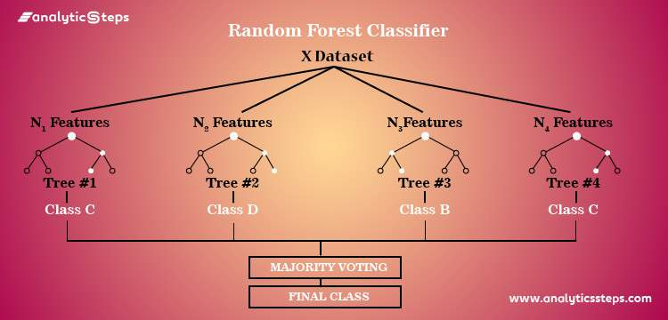

# Cardiovascular Prediction
Cardiovascular disease (CVD) is an umbrella term referring to conditions that affect
the heart or blood vessels [Reference](https://www.cdc.gov/heartdisease/facts.htm#:~:text=Heart%20disease%20is%20the%20leading,groups%20in%20the%20United%20States.&text=One%20person%20dies%20every%2034,United%20States%20from%20cardiovascular%20disease.&text=About%20697%2C000%20people%20in%20the,1%20in%20every%205%20deaths.). CVD is the leading cause of death for men, women, and people of most racial
(and ethnic) groups in the United States. It estimated that one person dies every 34 seconds in the United States from CVD [Reference](https://www.cdc.gov/heartdisease/facts.htm#:~:text=Heart%20disease%20is%20the%20leading,groups%20in%20the%20United%20States.&text=One%20person%20dies%20every%2034,United%20States%20from%20cardiovascular%20disease.&text=About%20697%2C000%20people%20in%20the,1%20in%20every%205%20deaths.). Furthermore, CVD accounts for over a third of all deaths worldwide. It needn't be mentioned that CVD is a very serious problem, so in this analysis, I attempt to predict CVD among people using the given variables. I kept the analysis simple, not resorting to much feature engineering. 

# 1. Data
The data was obtained from Kaggle, which can be found via this [link](https://www.kaggle.com/datasets/bhadaneeraj/cardio-vascular-disease-detection). 
The data contains over 48,000 observations and 12 columns. 
# 2. Methodology
The goal of the analysis is to train a model to correctly classify those with CVD. I used four classification models: K-Nearest Neighbors, Logistic Regression, Decision Tree, and Random Forest. I did hyperparameter tuning on all models. For the first three models, I used GridSearchCV. For the Random Forest model, I used RandomSearch. 
# 3. Results 
Winner Algorithm: Random Forest
 

Out of all the models used, the Random Forest model performed the best. The best score was about 73%. Although the results may seem, at first, unimpressive, it is important to recall the nature of the problem. I am trying to create a model that predicts CVD, which is no simple task. In fact, it is a difficult problem; if it weren't, then predicting CVD would be common practice. Furthermore, since I did minimal feature engineering, it is probable that the performance of the models could have been improved.