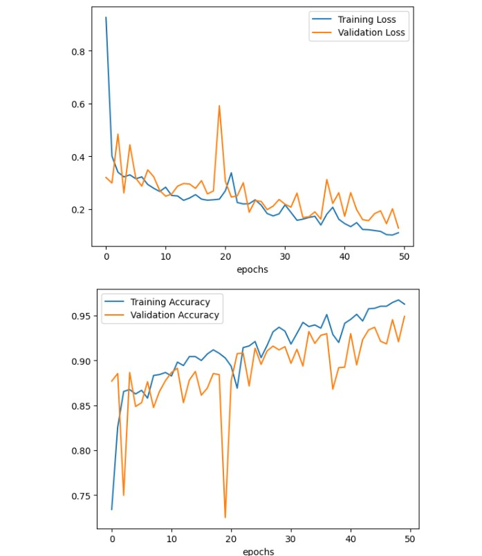

![satellite image] (satellite_image.jpg)

# Satellite Image Classification
    
From government agencies to e-commerce retailers, the need for consistent and efficient image classification is prevalent. For certain companies, like those of the e-commerce type, a significant portion of their revenue comes from their apparel and accessories, whose selling depends on their classifications. Case in point: image classification is needed and is important. It also poses a problem in computer vision, a (fascinating) [field] (https://www.ibm.com/topics/computer-vision#:~:text=Computer%20vision%20is%20a%20field,recommendations%20based%20on%20that%20information) in artificial intelligence that enables machines to derive meaningful information from images, videos, etc., with the motive of implementing actions and recommendations based on the information derived. 

## Problem Identification 

Given the significant progress made in the past several years on remote sensing (RS) image interpretation and its numerous applications, I decided to work with an RS image dataset, utilizing deep learning models–in specific, convolutional neural networks (CNN)–to classify images into their respective classes. 

## Project Organization

As mentioned, the goal is to train and employ a deep-learning model to successfully classify certain images. The project consists of four phases–namely: (1) sourcing and loading, (2) preprocessing, (3) training, and (4) data augmentation and dropout. I will expound on each phase.

## Sourcing and Loading Data

The RS image dataset can be found [here] (Link: https://www.kaggle.com/datasets/mahmoudreda55/satellite-image-classification). I assured that the dataset had a plausible amount of images that a deep-learning neural network model can train on. (Taking this step better assures improving the chances of the classification model performing better.) I was set on using the Keras library to do the deep-learning implementations. (Link: https://keras.io/) However, I required Tensorflow, the library that Keras is built on, to do the data splitting. I split the data into training and validation sets, keeping 30% of the training set for validation proposes. After splitting, I visually checked the images to see what I was working with.

![loading data] (classes-loading.jpg)

## Preprocessing

I started by checking the pixel dimensions of the images, so I can appropriately create the CNN models. In defining the model’s architecture, there were several questions guiding the process: (1) How many convolutional layers do I want?; (2) What should be the activation function for each layer?; and (3) How many hidden units should each layer have?
The architecture was to have six hidden layers (sans the input layer) with three convolutional layers following a “maxpooling” layer after each one. I also added a “flatten” layer before the output layer. As for the second question, I used primarily the “relu” activation function for its use-case generality. For the number of hidden units, I doubled the number for each proceeding convolutional layer. 

![image_2] (model_5.jpg)

## Training the Model

The focus of the training phase is to train the model with the training and validation sets and their respective true labels. 

I began compiling the model using “adam” as the optimizer, using “sparsecategoricalcrossenetropy” as the loss function, and getting the accuracy as the metric. 

I fitted the model, choosing to have it run for a total of 50 epochs. Then, I plotted the training loss vs. validation loss and the training accuracy vs. validation accuracy. I suspected the CNN model could be improved upon, so I went on to do data augmentation and dropout. The model’s performance was about 96%. 
(Post an image of the CNN model.)

## Data Augmentation and Dropout
    
The objective of this phase was to improve the CNN model. I decided on using data augmentation to generate additional training data from the existing images by augmenting them using random transformations that yield believable-looking images. By adding additional images to the dataset, the model will likely train more efficiently and, in turn, generalize better.

![augmented_images] (visuals_7.jpg)

After doing data augmentation, I checked to see the now augmented dataset’s images. I went on to create a new architecture. I created another CNN model using a dropout layer, which was the only parameter change.

![new_CNN] (model2_8.jpg)
## Results

The new CNN model’s performance was about 88%, which, although lower than the previous model’s performance, showed signs of genuine pattern recognition, rather than overfitting. 

![results] (result_9.jpg)
![visuals] (visuals_10.jpg)
## Takeaways

I did not have a test set to check how well the model generalized. However, generalization can be fairly easily accounted for with the introduction of new data.